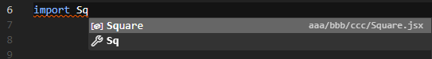
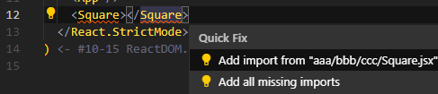

# Guia de Auto Import em React

Esse é uma guia de como configurar o auto import para seu projeto React. Isso vai te permitir usar componentes sem importar manualmente.

>  **Nota:** Este guia usa de features nativas do próprio editor VS Code, sem nenhuma extensão adicional do Marketplace. (Sem ESLint)

## Passo 1: Conectar arquivos JavaScript

O VS Code precisa saber quais arquivos JavaScript estão conectados ao seu projeto. Para fazer isso, você precisa adicionar um arquivo `jsconfig.json` na raiz do seu projeto.

Mínimo `jsconfig.json`:

```json
{
  "compilerOptions": {
    "target": "ES6"
  },
  "include": ["src/**/*"]
}
```

Com mais features, `jsconfig.json`:

```json
{
  "compilerOptions": {
    "target": "ES6",
    "baseUrl": ".",
    "paths": {
      "~/*": ["src/*"]
    }
  },
  "include": ["src/**/*"],
  "exclude": ["node_modules", "build", "dist"]
}
```

### O que cada opção faz?

- `compilerOptions.target`: Define a versão do ECMAScript que o projeto suporta.
- `compilerOptions.baseUrl`: Define o diretório base para resolução de módulos.
- `compilerOptions.paths`: Cria aliases para importar módulos.
- `include`: Define quais arquivos devem ser incluídos no projeto.
- `exclude`: Define quais arquivos devem ser excluídos do projeto.

> **Nota:** Use o exclusão de pastas como `node_modules`, `build` e `dist` para evitar que o VS Code tente indexar arquivos desnecessários.

> **Nota:** O `paths` é opcional, mas é útil para criar aliases para diretórios encurtando os caminhos de importações.

### Resultado 1

Agora o VS Code vai conseguir identificar os arquivos JavaScript do seu projeto. Isso vai afetar o auto complete ao escrever importações manualmente.



## Passo 2: Import Fix

O VS Code consegue fazer auto import dos componentes sem import a partir do quick fix. Usando o atalho `Ctrl + .` na linha serão abertas opções de correções automáticas. Há a opção de importar o componente automaticamente ou todas as importações do arquivo.



Uma recomendação é ativar a opção `javascript.suggest.autoImports` nas configurações do VS Code.

```json
{
  "javascript.suggest.autoImports": true
}
```
### Resultado  2

O VS Code está capaz de identificar os componentes e fazer auto import deles sob sua solicitação, mas ainda não faz isso automaticamente.

## Passo 3: Auto Fix Import

Agora, vamos automatizar essa correção de importações faltantes. Para isso, vamos associar ao momento de salvar o arquivo a correção automática de importações.

### Ao Salvar:

Em seu `settings.json`, adicione a seguinte configuração:

```json
{
  "editor.codeActionsOnSave": {
    "source.organizeImports": true,
    "source.addMissingImports": true
  },
}
```

> **Nota:** Pode ser em seu `settings.json` global ou no do projeto.

### Resultado 3

Agora, ao salvar o arquivo, o VS Code vai corrigir automaticamente as importações faltantes dos componentes.

## Outros Truques

Se assim preferir, você pode adicionar atalhos para executar a correção de importações no atalho de teclas. Em seu `keybindings.json`, adicione os seguintes atalhos: 

```json
{
  "key": "ctrl+s",
  "command": "workbench.action.files.save",
  "when": "editorTextFocus"
},
{
  "key": "ctrl+s",
  "command": "editor.action.codeAction",
  "when": "editorHasCodeActionsProvider && editorTextFocus && !editorReadonly"
}
```
Assim, o mesmo atalho para salvar o arquivo também vai corrigir as importações.